# Structure From Motion with OpenCV
The program follows the process below:
1. Look for SIFT features from two images of a scene captured from different angle.
2. Compute local matches and find closest neighbors.
3. Filter out bad neighbors by comparing distance.
4. Draw remaining matches on the image and output it.
5. Find inlier matches by calculating the essential matrix and mask with RANSAC.
6. Find rotation and translation matrices of one image.
7. Compute 3D point cloud and plot the graph.

## Results
### Pair 1
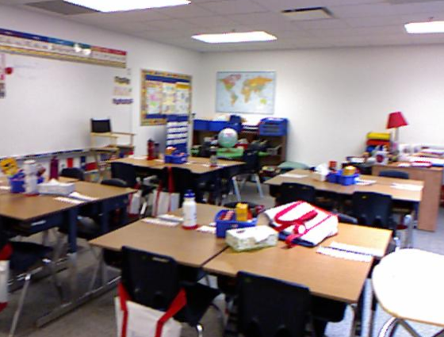 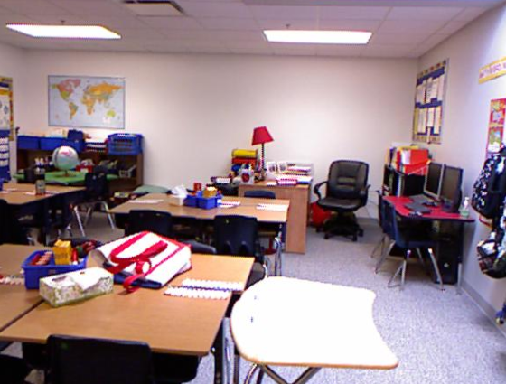

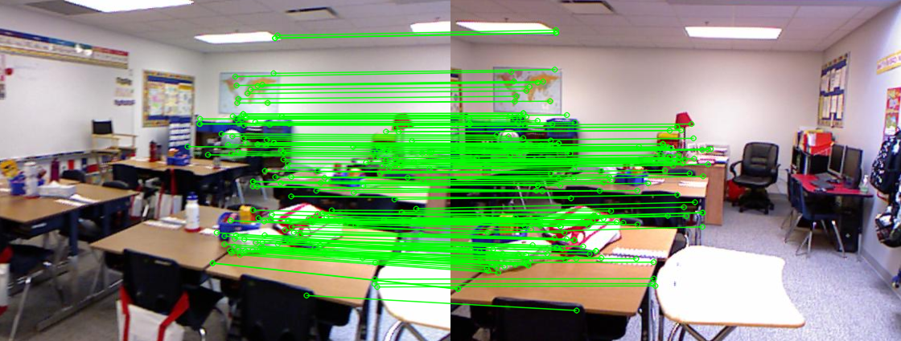

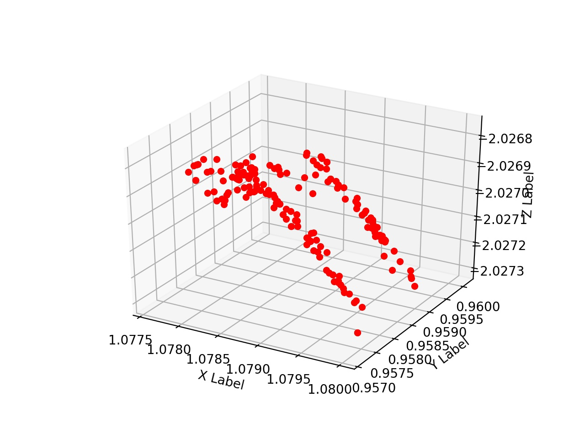

### Pair 2
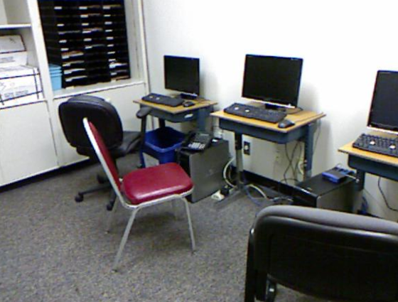 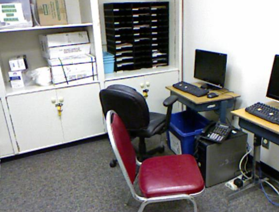

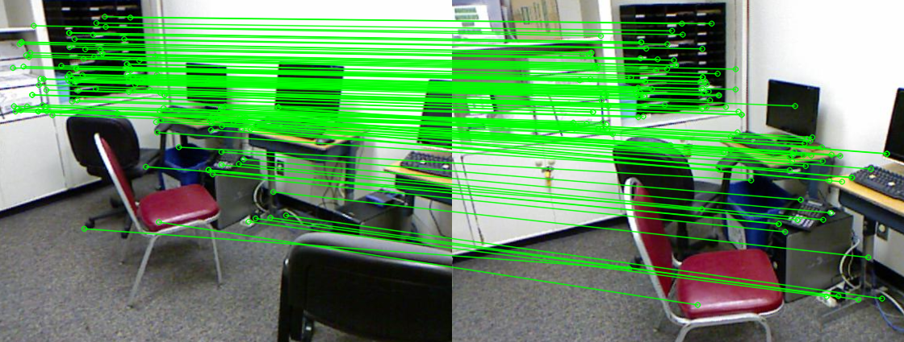

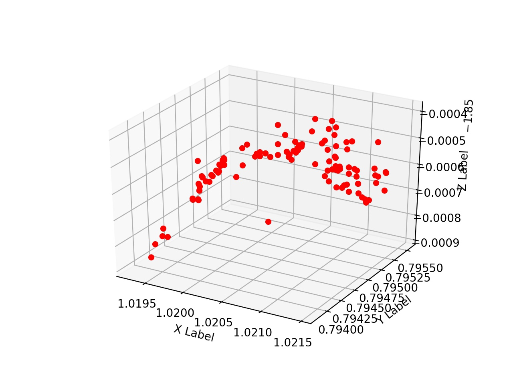

### Pair 3
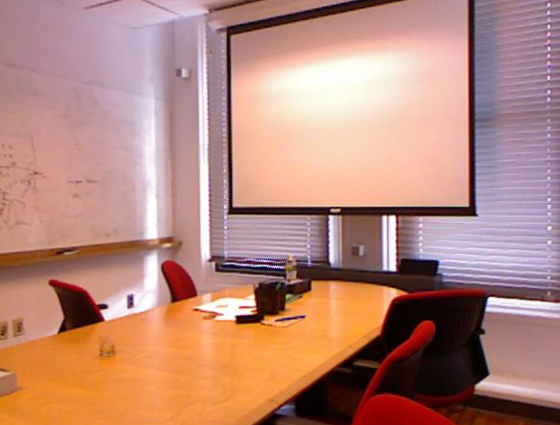 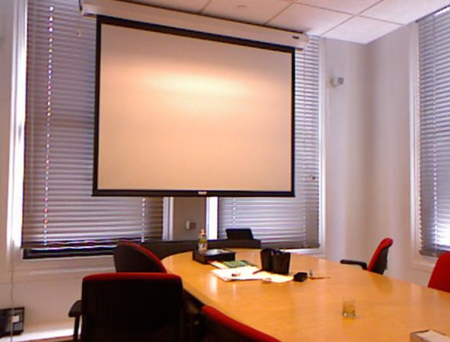

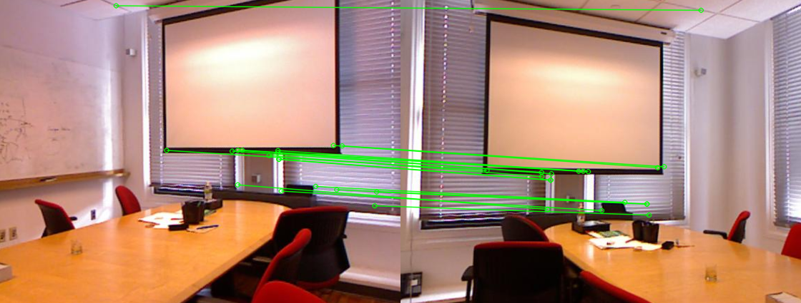

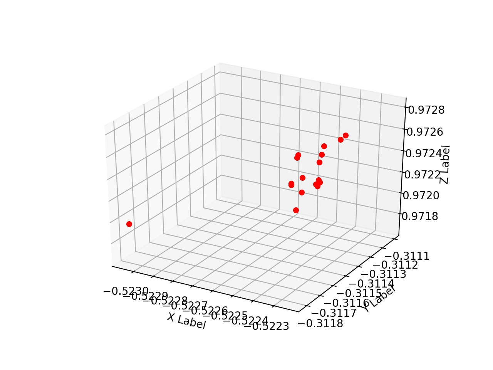

### Feature Matches
